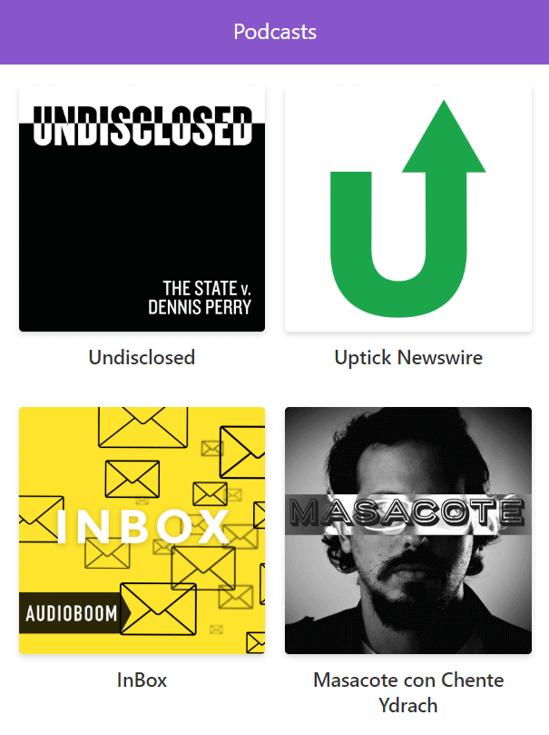

# App de Podcastr de Platzi

App de Podcast integrada con la API de Audioboom.

## ¿Cómo funciona?

Requiere Node.js 10

* `npm install` para instalar dependencias.
* `npm run dev` para el entorno de desarrollo.
* `npm run build && npm start` para el entorno de producción.

## Licencia

MIT